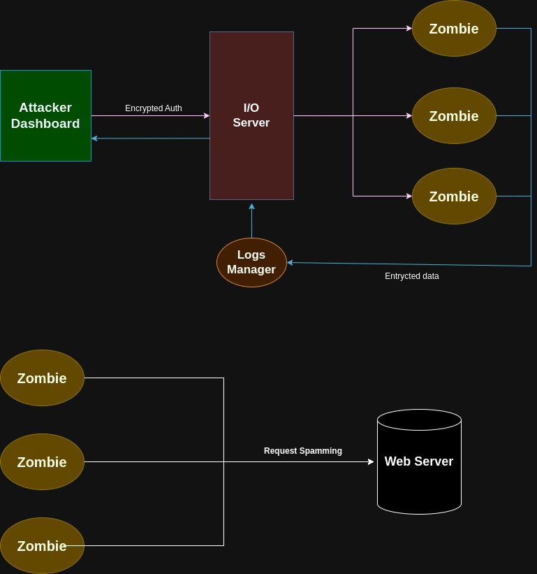

# Vepar Botnet

Vepar Botnet is a distributed system designed for educational and research purposes. This botnet consists of three main modules: an attacker's dashboard, a command server, and zombie clients. The system allows the attacker to send commands to the zombies, which can execute various tasks, including performing Denial of Service (DoS) attacks on targeted websites.

## Modules Overview

1. **Attacker Dashboard**: A web-based interface that allows the attacker to send commands to the botnet. This dashboard provides a user-friendly experience for managing the botnet and issuing commands.

2. **Command Server**: The central server that receives commands from the attacker dashboard and forwards them to the connected zombie clients. It acts as the intermediary between the attacker and the zombies.

3. **Zombie Clients**: The client modules that connect to the command server. These clients receive commands and execute them, primarily focusing on executing DoS attacks against specified targets.

## Checklist

Before running Vepar Botnet, ensure the following steps are completed:

### Setup

- [ ] **Clone the repository**: Ensure you have the latest version of the Vepar Botnet code.
- [ ] **Install dependencies**: Run `npm install` or the appropriate command for your environment to install required packages.
- [ ] **Configure environment variables**: Set up any necessary environment variables in a `.env` file, including server ports and passwords.

### Running the Modules

- [ ] **Start the Command Server**: Launch the server that will manage communications between the attacker dashboard and the zombies.
- [ ] **Deploy the Attacker Dashboard**: Start the web dashboard for the attacker to send commands.
- [ ] **Launch Zombie Clients**: Start the client instances that will connect to the command server and listen for commands.

### Testing

- [ ] **Connect the Zombie Clients**: Verify that the zombie clients successfully connect to the command server.
- [ ] **Send Test Commands**: Use the attacker dashboard to send test commands to the zombies to ensure they are functioning correctly.

### Security Considerations

- [ ] **Use in a controlled environment**: Vepar Botnet is intended for educational and research purposes. Do not deploy it in production or against unauthorized targets.
- [ ] **Monitor network traffic**: Ensure you are aware of the traffic generated by the botnet to avoid detection by network security systems.
